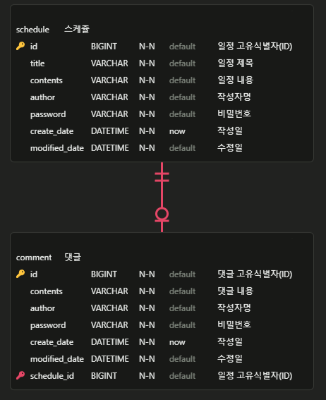

# 일정 관리 앱

---

## 프로젝트 정보
- 개발 기간 : 2026.02.03 ~ 2026.02.05
- 목적 : 일정을 보다 쉽게 관리하기 위해서 제작하였습니다.

---

## 프로젝트 소개
작성자별 일정 생성/조회/수정/삭제 기능을 제공하는 백엔드 일정 관리 시스템입니다.

### 프로젝트 목적
- Spring Boot입문 및 JPA실습
- REST API 설계 실습
- CRUD 이해
- DTO/Entity 분리 및 계층 구조 설계 연습

### API 명세서
[API명세서 바로가기](https://web.postman.co/workspace/My-Workspace~365db89f-86bc-4cd9-8450-a15304e11d41/documentation/34034548-bcca7c1f-812f-490e-ba74-d43cb99c31e4)

### ERD

### TIL & 트러블 슈팅
[티스토리 바로가기](https://hyunspaceworkshop.tistory.com/18)